# Facebook Login - RN(Android)

Facebook login integration with React native app

# Prerequisites

```bash
npm i react-native-fbsdk-next --save
```

## STEP : 1

[**Craete a facebook developer account(Meta)**](https://developers.facebook.com/apps/)

Create app

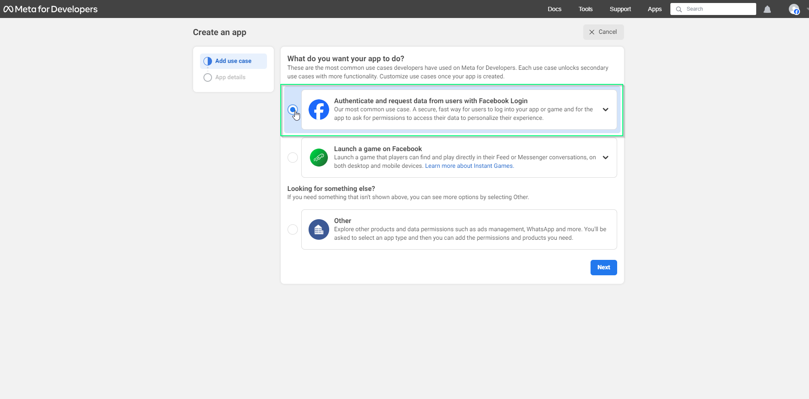

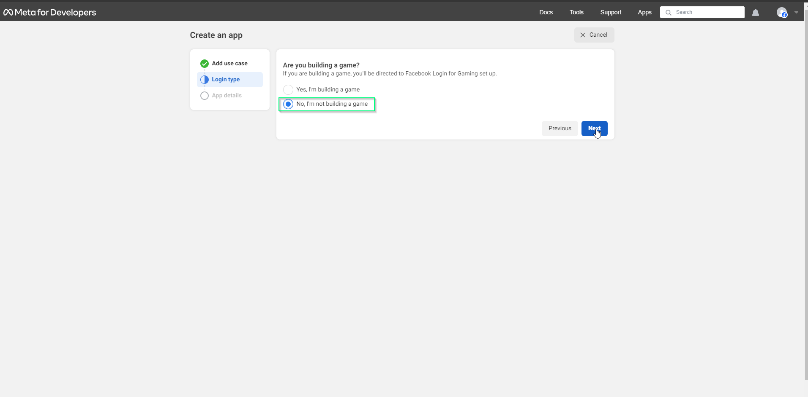

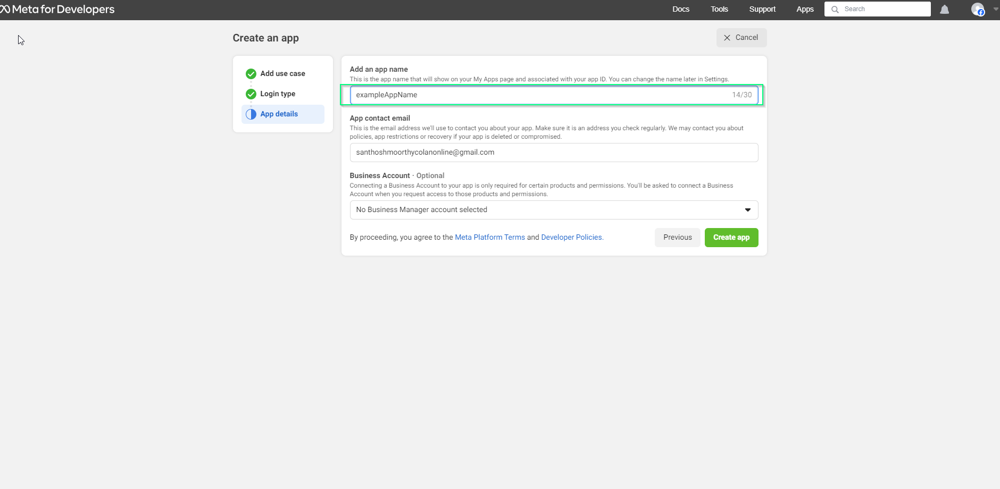

### After registration Dashboard will appear:

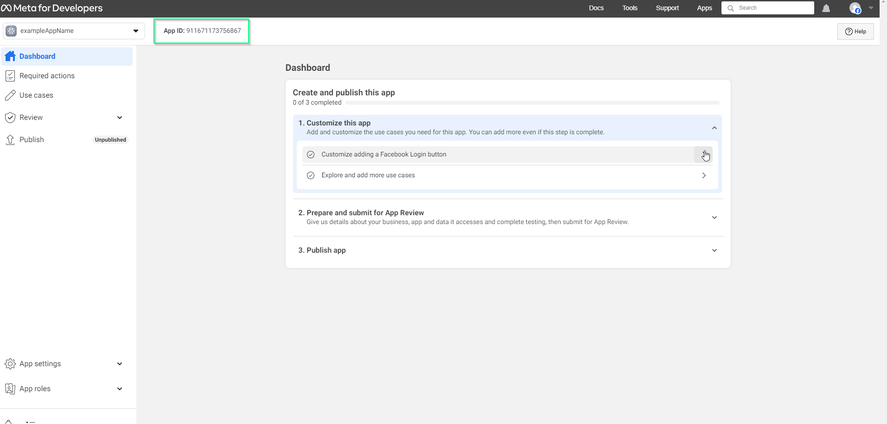

Go to App settings > Basic

## you will get App Id and App secret id(Client token id)

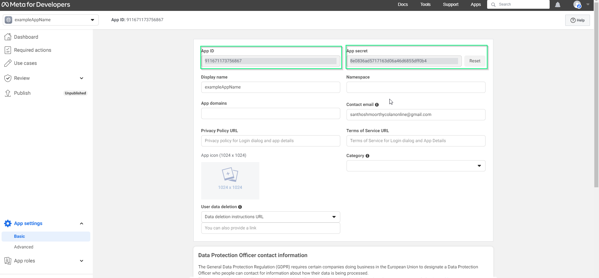

## STEP : 2

Now if you scroll down a bit then you will see an Add Platform option. We will add Android and IOS platform using it so that we can log in on both the platform

Click Add platform > select platform Android

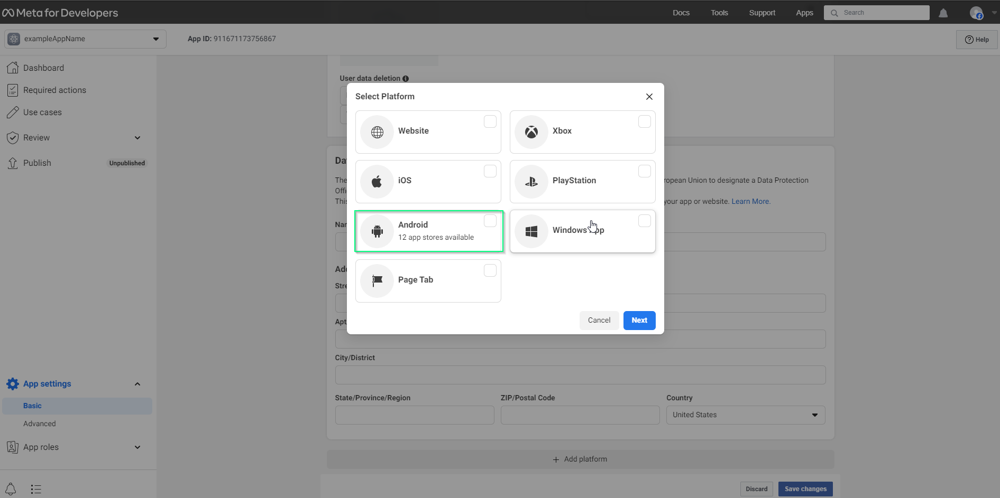

Select Android store > Google play

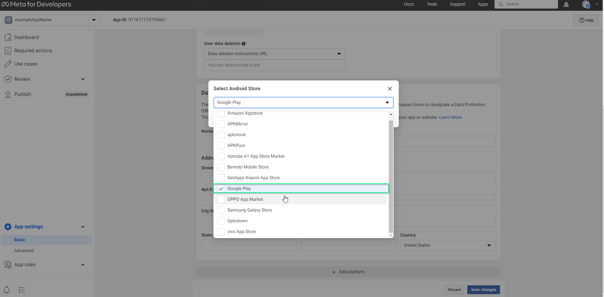

1. Package name from your AndroidManifest.xml file (YourProject > android > app > src > main > AndroidManifest.xml).
2. Class Name will be “Package name + MainActivity”.
3. For the Key Hashes please follow [**Getting Key Hash for Facebook Console**](https://aboutreact.com/getting-key-hash-for-facebook-console/)

## STEP : 3

For the windows you need to download the [**OpenSSL**](https://code.google.com/archive/p/openssl-for-windows/downloads) else you will find the following error.

Click and download

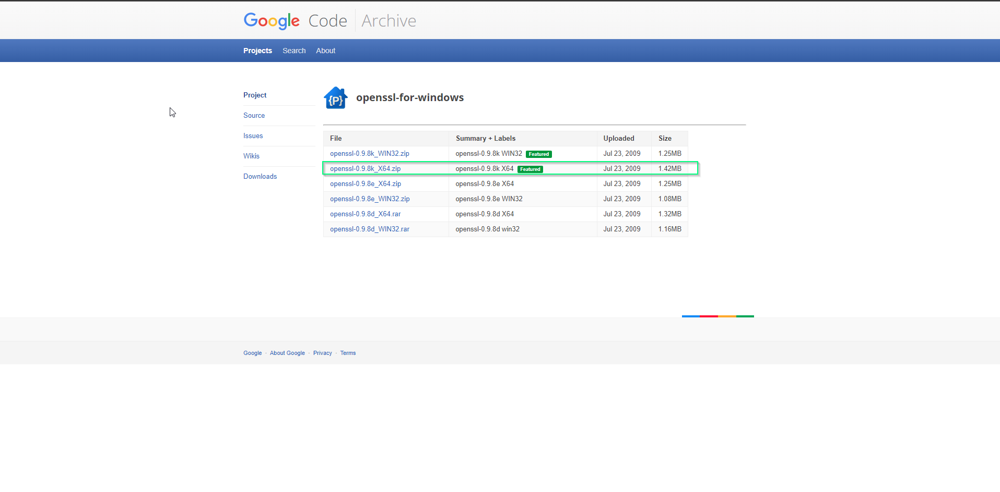

Debug Key Hash

After downloading the OpenSSL you can unzip it in your C directory and run command (Before running please check the file path once)

```bash
keytool -exportcert -alias androiddebugkey -keystore %HOMEPATH%\.android\debug.keystore | C:\openssl\bin\openssl.exe  sha1 -binary | C:\openssl\bin\openssl.exe base64
```

**Note** : Change OpenSSL path
keytool -exportcert -alias androiddebugkey -keystore %HOMEPATH%\.android\debug.keystore | replace your openSSL path sha1 -binary | please replace your openSSL path base64

You will get hash key

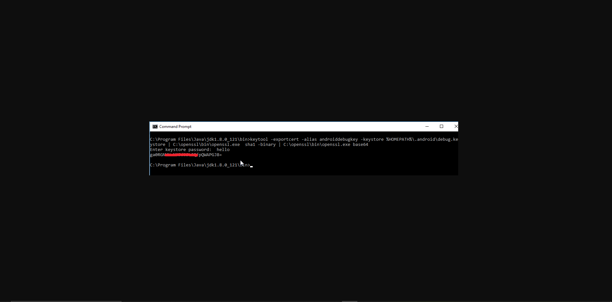

After filling that hit Save changes button.
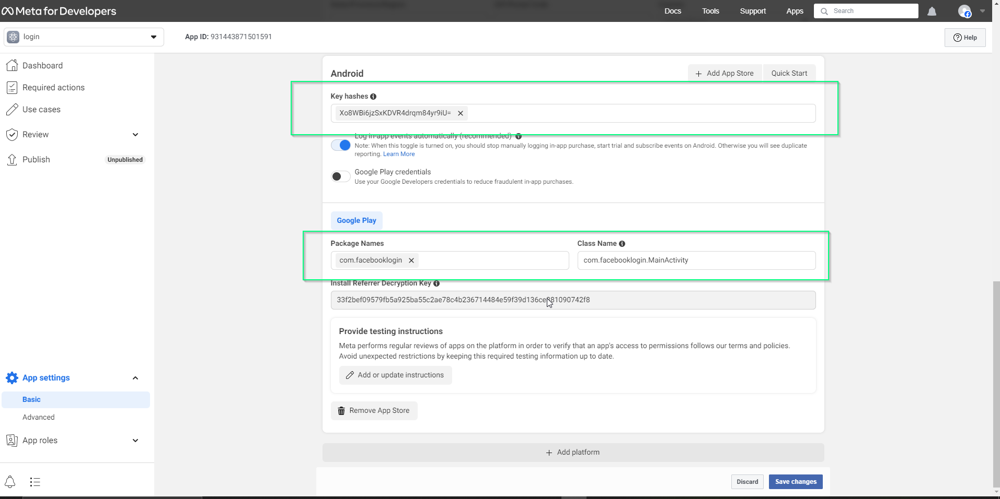

# Note : Edit Your Resources and Manifest and Integrate the Facebook SDK (in configuration)

[**Configuration**](https://developers.facebook.com/docs/facebook-login/android)

#### Add Facebook App Id in Android Code

– After adding the Android platform add the following meta-data in the AndroidManifest.xml file in application tag

```bash
<meta-data android:name="com.facebook.sdk.ApplicationId" android:value="@string/facebook_app_id"/>
```

After finished above setup run below code, you will get token

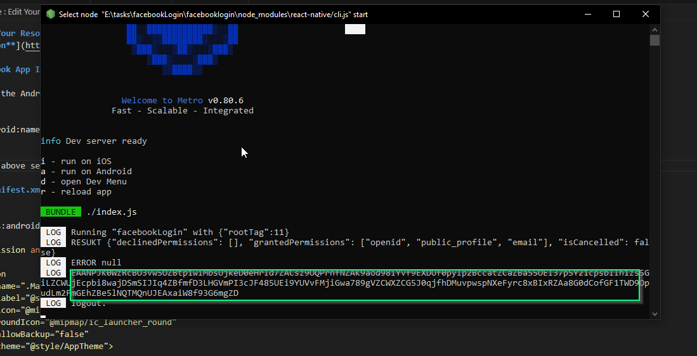

### (AndroidManifest.xml) file

```bash
<manifest xmlns:android="http://schemas.android.com/apk/res/android" package="com.facebooklogin">

    <uses-permission android:name="android.permission.INTERNET" />

    <application
      android:name=".MainApplication"
      android:label="@string/app_name"
      android:icon="@mipmap/ic_launcher"
      android:roundIcon="@mipmap/ic_launcher_round"
      android:allowBackup="false"
      android:theme="@style/AppTheme">
      <activity
        android:name=".MainActivity"
        android:label="@string/app_name"
        android:configChanges="keyboard|keyboardHidden|orientation|screenLayout|screenSize|smallestScreenSize|uiMode"
        android:launchMode="singleTask"
        android:windowSoftInputMode="adjustResize"
        android:exported="true">
        <intent-filter>
            <action android:name="android.intent.action.MAIN" />
            <category android:name="android.intent.category.LAUNCHER" />
        </intent-filter>
      </activity>
      <meta-data android:name="com.facebook.sdk.ApplicationId" android:value="@string/facebook_app_id"/>
   	  <meta-data android:name="com.facebook.sdk.ClientToken" android:value="@string/facebook_client_token"/>
       <activity android:name="com.facebook.FacebookActivity"
        android:configChanges=
                "keyboard|keyboardHidden|screenLayout|screenSize|orientation"
        android:label="@string/app_name" />
      <activity
          android:name="com.facebook.CustomTabActivity"
          android:exported="true">
          <intent-filter>
              <action android:name="android.intent.action.VIEW" />
              <category android:name="android.intent.category.DEFAULT" />
              <category android:name="android.intent.category.BROWSABLE" />
              <data android:scheme="@string/fb_login_protocol_scheme" />
          </intent-filter>
      </activity>
    </application>
</manifest>

```

```bash
import React, {Component} from 'react';
import {View} from 'react-native';
import {LoginButton, AccessToken, LoginManager} from 'react-native-fbsdk-next';

const App = () => {
  return (
    <View
      style={{
        flex: 1,
        backgroundColor: 'white',
        justifyContent: 'center',
        alignItems: 'center',
      }}>
      <LoginButton
        onLoginFinished={(error, result) => {
          console.log('RESUKT', result);
          console.log('ERROR', error);
          if (error) {
            console.log('login has error: ' + result.error);
          } else if (result.isCancelled) {
            console.log('login is cancelled.');
          } else {
            AccessToken.getCurrentAccessToken().then(data => {
              console.log(data.accessToken.toString());
            });
          }
        }}
        onLogoutFinished={() => console.log('logout.')}
      />
    </View>
  );
};
export default App;
```
